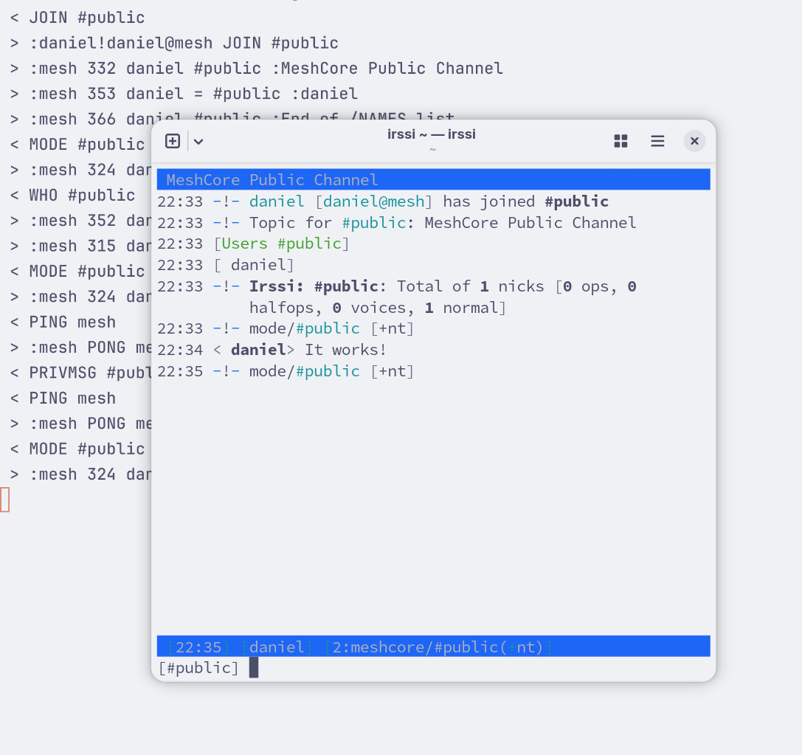

# meshcore-irc-bridge

Simple IRC server bridge on top of MeshCore

Use your favorite IRC client to join the mesh




# Usage

Start the bridge implementing the IRC server protocol on top of MeshCore

```bash
python meshcore-irc-bridge.py --serial /dev/serial/by-id/usb-Heltec..
```

Use your favorite IRC client and
1. Connect to `irc://127.0.0.1:6667`
2. Join the `#public` channel


## Clients

Tested IRC clients

Setup with `irssi`

```bash
$ irssi

/network add meshcore -nick daniel
/server add -network meshcore -nocap -auto 127.0.0.1 6667
/channel add -auto #public meshcore

/connect meshcore
```

Setup with `weechat`

```bash
$ weechat

/server add meshcore 127.0.0.1/6667 -notls
/set irc.server.meshcore.autoconnect on
/set irc.server.meshcore.nicks daniel
/set irc.server.meshcore.autojoin #public

/connect meshcore
```


# Limitations

1. Very basic features implemented against [RFC 1459](https://www.rfc-editor.org/rfc/rfc1459)
2. Channel: `Public` (MeshCore) maps to `#public` (IRC); no other channels
3. Tested with a few basic IRC clients

To debug the protocol, start the bridge server with the `--verbose` flag.


## License

Copyright © 2026 Daniel J. Hofmann

Distributed under the MIT License (MIT).
